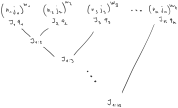

```@meta
DocTestSetup = :(using AtomicLevels)
```

# [Atomic configuration state functions (CSFs)](@id man-csfs)

AtomicLevels also provides types to represent symmetry-adapted atomic states, commonly referred to as [configuration state functions (CSFs)](https://en.wikipedia.org/wiki/Configuration_state_function). These are linear combinations of Slater determinants arising from a particular _configuration_, that are also eigenstates of angular momentum operators.

!!! info "Angular momentum operators"

    With relativistic orbitals and ``jj``-coupling, _angular momentum operators_ refer to the ``J^2`` and ``J_z`` operators.

    However, when working with non-relativistic orbitals and in ``LS``-coupling, they refer to both the orbital angular momentum operators (``L^2``, ``L_z``) and the spin angular momentum operators (``S^2``, ``S_z``). In  this case, the orbitals and CSFs are simultaneous eigenstates of both the orbital and spin angular momentum.

    In the [Background](@ref) section, we use just the total angular momentum operators (``J^2``, ``J_z``) when illustrating the theoretical background.

## Background

When constructing a basis for many-particle atomic states, you start from a set of single-particle states (orbitals) and form anti-symmetric many-particle product states (Slater determinants) of the desired number of particles. Superpositions of said determinants can then represent full many-electron wavefunctions. In principle, if the set of one-particle orbitals is complete, the set of all Slater determinants would form a complete many-particle basis.

However, even if your orbitals are eigenstates of the angular momentum operators ``J^2`` and ``J_z``, the Slater determinants, formed from these orbitals, in general, are not. As angular momentum symmetry is a useful symmetry to adhere to when working with atomic states, this is where CSFs come in: they form a _symmetry adapted_ many body basis, representing the same many-particle space, but each state is now also an eigenstate of angular momentum. They are related to the underlying Slater determinats via a basis transformation.

!!! note "Other symmetries"

    You can also imagine CSFs that are adapted to other symmetries. However, at this time, AtomicLevels only supports CSFs adapted to angular momentum.

### Forming a CSF

The philosophy behind CSFs is similar to how you can use the [Clebsch–Gordan coefficients](https://en.wikipedia.org/wiki/Clebsch%E2%80%93Gordan_coefficients) ``C_{j_1m_1j_2m_2}^{J M}`` to couple product states of angular momentum eigenstates ``\ket{j_1 m_1} \ket{j_2 m_2}``, which themselves in general are not eigenstates of total angular momentum, into angular momentum eigenstates ``\ket{j_1, j_2; J M}`` by creating superpositions with appropriate coefficients:

```math
\ket{j_1, j_2; J M} = \sum_{m_1,m_2,M}
C_{j_1m_1j_2m_2}^{J M}
\ket{j_1 m_1} \ket{j_2 m_2}
```

where the valid ``J`` values are ``|j_1 - j_2| \leq J \leq j_1 + j_2``.

In the multi-electron case, the states that you multiply together are the atomic orbitals. However, it is complicated by two facts:

1. There are usually more than two electrons.

    In a multi-electron case, it is perfectly valid to apply the Clebsch–Gordan relation recursively until all electrons have been coupled, but in general you can end up with the same total angular momentum for different states (corresponding to different coupling sequences). So, the angular momentum eigenvalues are no longer sufficient to always uniquely identify a state.

2. Electrons are fermionic particles adhering to the [Pauli principle](https://en.wikipedia.org/wiki/Pauli_exclusion_principle).

   This means that not all direct products of single-particle states are valid (the same single-particle state can not be repeated) or unique (anti-symmetry means that the order in the product does not matter). This, in turn, means that not all the coupled eigenstates predicted by the Clebsch–Gordan relation actually exist and you can not use the Clebsch–Gordan relation directly to determine their coefficients.

To work within those constraints, AtomicLevels specifies a _coupling scheme_. That is, the CSFs contain additional data that allows the states to be identified uniquely.

!!! note "Orbital vs subshell"

    In the following the word "subshell" is used to refer to the orbitals in a configuration (i.e. a set of states with e.g. the same ``n`` and ``\ell`` quantum numbers). This is because the word "orbital" can be ambiguous (referring to either to a subshell or an specific state).

**`CSF` type.** In AtomicLevels, CSFs are represented with the [`CSF`](@ref) type. An instance of a [`CSF`](@ref) only specifies CSFs up to the total angular momentum (i.e. it actually represent a set of states corresponding to the different possible ``J_z`` quantum numbers).

Forming a CSF is a multi-step process:

1. The starting point for a CSF is a configuration ([`Configuration`](@ref)), i.e. a list of subshells (the orbitals in the configuration) and their occupations (how many electrons on the subshell). Each configuration corresponds to a set of Slater determinants, generated by considering all the possible combinations of `m` quantum numbers of the orbitals.

2. The next step is to couple _each subshell_ into an angular momentum eigenstate (e.g. to form a single angular momentum eigenstate out of the 3 electrons on a ``3d_{5/2}`` orbital/subshell). As the single particle spaces for the subshells are disjoint, the space of many-particle determinants can be thought of as a product space of subshells determinant spaces.

   Due to the fermionic nature of the electrons, even determining the valid ``J`` values for the subshells is non-trivial. Also, if you go to high enough angular momenta of the orbital and high enough particle number, the angular momentum eigenvalues are no longer sufficient to uniquely identify the subshell terms. So the [`CSF`](@ref) type stores them as instances of [`IntermediateTerm`](@ref), instead of simple numbers (see [Term symbols](@ref man-terms) for more information).

3. Once the electrons on individual subshells are coupled, we can couple the subshells themselves together. As the orbitals in a subshell are distinct from the ones in other subshells, this can easily be done with just Clebsch–Gordan coefficients.

   In AtomicLevels, we assume that the coupling is done by starting from the leftmost orbital pair, coupling those subshells together. Then the coupled two subshells are taken and coupled to the next subshells, and so on. In the end, we get a _coupling tree_ that looks something like this:

   

    On the illustration, ``J_i, q_i`` pairs refer to the subshell couplings (``q_i`` disambiguating the state if ``J_i`` is not sufficient for uniqueness), and ``J_{1:i}`` refers to the total angular momentum of the first ``i`` coupled subshells. The total angular momenta of the last coupling (``J_{1:k}``) determines the angular momentum of the whole CSF.

So, all in all, a CSF is a configuration, together with the numbers ``J_i``, ``q_i`` and ``J_{1:i}`` uniquely determining the coupling.

## Coupling schemes

Various coupling schemes exist and AtomicLevels is currently opinionated about it, using the scheme described above. The only generality is that it allows for different coupling schemes depending on whether one works with relativistic or non-relativistic orbitals.

### ``LS``-coupling

In ``LS``-coupling, each orbital must be a [`Orbital`](@ref), specified by its ``n`` and ``\ell`` quantum numbers. Implicitly, each orbital also has a spin of ``s = 1/2``.

When coupling is performed, the ``L`` and ``S`` spaces are coupled separately, which is possible because the real and spin spaces are orthogonal. Each subshell then gets an ``L`` and ``S`` values eigenvalue (together with an additional quantum number to resolve any ambiguity). Similarly, couplings between subshells are also defined by the ``L`` and ``S`` values separately.

The CSF will then be a simultaneous eigenstate of ``L`` and ``S``, but does not define a ``J`` value. In other words, AtomicLevels currently does not perform ``LSJ``-coupling.

The convenience type [`NonRelativisticCSF`](@ref) is provided to construct CSFs with non-relativistic orbitals in ``LS``-coupling.

### ``jj``-coupling

``jj``-coupling is used for [`RelativisticOrbital`](@ref)s, where each orbital only has the total angular momentum value ``J``. In this coupling scheme, only the ``J`` values coupled. Intermediate terms are the ``J`` values (together with disambiguating quantum numbers, like seniority), and the intra-shell couplings are also defined by their ``J`` value.

The convenience type [`RelativisticCSF`](@ref) is provided to construct CSFs with relativistic orbitals in ``jj``-coupling.

## Reference

```@docs
CSF
NonRelativisticCSF
RelativisticCSF
csfs
orbitals(::CSF)
term(::CSF)
```

## Index

```@index
Pages = ["csfs.md"]
```

```@meta
DocTestSetup = nothing
```
